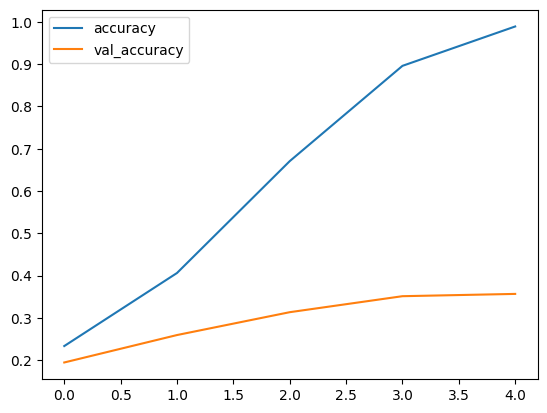
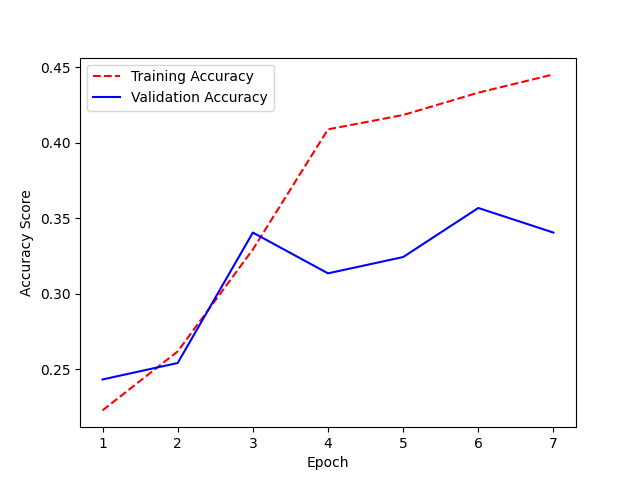
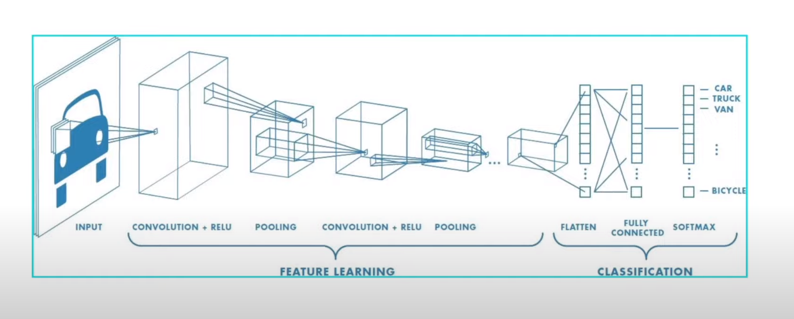

# Deep Learning Dog Breed Classification

This project uses TensorFlow and Keras to create a convolutional neural network (CNN) model for dog breed classification. Our trained model can effectively classify images of dogs according to their breeds.

# Project Overview

1. **Data preprocessing:** Load and preprocess a dataset of dog images.
2. **Model Architecture:** Train a CNN for breed classification.
3. **Model Evaluation:** Evaluate the model performance and make improvements.
4. **Deployment:** Build a web app for users to classify their own dog images.

## Model Architecture

The CNN model for this project was built using TensorFlow's Keras API and consists of several key layers:

1. **Sequential Model**: We used a Sequential model as it's suitable for a stack of layers where each layer has exactly one input tensor and one output tensor.

2. **Rescaling Layer**: The Rescaling layer normalizes the pixel values in the images, changing them from a range of 0-255 to a range of 0-1.

3. **Conv2D Layer**: This layer applies 16 filters of size 3x3 with 'relu' activation. The padding is set to 'same' ensuring the output has the same dimensions as the input.

4. **Flatten Layer**: This layer transforms the 2D image arrays (256x256 pixels) into 1D arrays of 196,608 pixels (256 * 256 * 3), making the data compatible with the Dense layer that follows.

5. **Dense Layer**: A Dense layer with 128 neurons and 'relu' activation function is used. It's a standard layer type that works well in most cases.

6. **Output Layer**: The final Dense layer represents the output. It has a neuron for each breed of dog, outputting a value representing the likelihood of the image representing that breed.

###  Performance Analysis

The model was trained for 5 epochs. Below is a brief summary of the model's performance after each epoch:

1. **Epoch 1:** The model achieved a training accuracy of 23.35% with a validation accuracy of 18.38%. The training and validation loss were 65.55 and 13.26 respectively.
2. **Epoch 2:** The training accuracy increased to 33.20% while the validation accuracy also increased slightly to 20.54%. The training and validation loss decreased to 6.49 and 8.06 respectively.
3. **Epoch 3:** The model saw improvements with a training accuracy of 48.58% and a validation accuracy of 19.46%. The training and validation loss further decreased to 3.06 and 7.06 respectively.
4. **Epoch 4:** The training accuracy went up to 54.52% with a slight increase in validation accuracy to 21.08%. The training and validation loss reduced to 2.38 and 5.62 respectively.
5. **Epoch 5:** The final epoch saw the highest improvements with a training accuracy of 62.08% and a validation accuracy of 23.24%. The training and validation loss were the lowest at this stage, at 1.89 and 4.75 respectively.

Below is the visualization of the model's performance:

From the results, it can be seen that the model's performance on the training set improved consistently with each epoch. However, the validation accuracy didn't improve at the same rate, indicating that the model may be overfitting to the training data. Future iterations of the model should include strategies to prevent overfitting, such as dropout, regularization, or data augmentation.

### Model Improvement 

A number of improvements have been incorporated into the model to enhance its performance and to mitigate overfitting:

1. **Additional Conv2D and MaxPooling2D Layers:** Additional convolutional layers with larger filters (4x4) and 'relu' activation function were added. These are followed by max pooling layers. By doing so, the model is now capable of identifying complex patterns from the images at different levels of abstraction.

2. **Dropout Layer:** To prevent overfitting, a dropout layer was added to the architecture. This layer randomly sets 20% of the input units to 0 during each training step, thereby preventing our model from over-relying on any particular feature.

3. **Data Augmentation:** To make the model more robust, data augmentation techniques were introduced. The techniques include horizontal flipping, rotation by up to 20%, and zooming up to 20%. This helps the model generalize better by exposing it to different variations of the training images.

4. **Early Stopping:** To avoid overfitting, an early stopping mechanism was implemented. It monitors the validation loss during training and stops the model from training further when there's no significant improvement in validation loss after 3 consecutive epochs.

These modifications are expected to improve the model's performance and help it generalize better to unseen data. The performance of the improved model will be discussed in the next section.

### Enhanced Model Performance 

The improved model demonstrates significant advancements in its performance. In the initial training phase (Epoch 1), the model achieved an accuracy of 22.27% on the training set and 24.32% on the validation set. By the 7th epoch, the model's performance had considerably improved, reaching an accuracy of 44.53% on the training set and 34.05% on the validation set.

Although the validation accuracy is lower than the training accuracy, this discrepancy is a common phenomenon in machine learning models, indicating that the model is slightly overfitting to the training data. However, the use of techniques such as Dropout and data augmentation in the model architecture, along with early stopping, helps to reduce overfitting.

The overall trend suggests that the model is learning and improving with each epoch. This positive trajectory indicates the effectiveness of the implemented modifications, including the introduction of more Conv2D layers, MaxPooling2D layers, data augmentation, and an early stopping mechanism.

The performance of the model is visualized in the accuracy plot shown below:

Further improvements can potentially be achieved by increasing the complexity of the model, introducing more data, or fine-tuning the existing parameters.

### Deployment: Dog Breed Classification Web App

The model has been integrated into a web application built with Streamlit, a Python framework that allows for rapid development of data apps. This web app allows users to upload an image of a dog, and then utilizes the trained model to predict the breed of the dog in the image.

The interface is quite straightforward and user-friendly. After launching the app, users will see a welcome title, "Dog Breed Classifier", and instructions guiding them to upload an image. Users can upload an image by clicking on the "Choose an image..." button. Once an image is uploaded, it is displayed on the web app and the model begins its prediction process. After prediction, the breed of the dog in the image is displayed on the screen.

Here's a snapshot of what the web app interface looks like:

The web app is designed to process the uploaded images according to the input requirements of the model. It resizes the image, scales pixel values, and expands the image's dimensions before passing the image to the model for breed prediction. The model then returns the breed that received the highest score in the prediction.

This web app is a powerful tool that makes the dog breed classification model accessible to non-technical users. It's a practical demonstration of how deep learning models can be integrated into user-friendly applications for real-world use.

To use the app, you will need to install Streamlit and other required Python packages. Once you have installed these, you can start the app by running the script using Streamlit from your command line:
